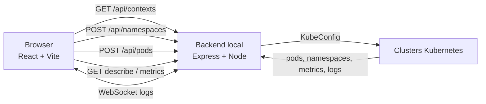

# ops-flow

> Visao unificada, local e read-only de workloads Kubernetes em multiplos clusters e namespaces.

O **ops-flow** reduz a necessidade de repetir comandos `kubectl` trocando de contexto manualmente. A aplicacao permite selecionar varios contextos do kubeconfig, combinar namespaces, consultar os pods em paralelo e investigar cada pod em uma unica interface web.

A unidade de consulta do sistema e o par:

```text
(cluster/contexto, namespace)
```

Cada resultado preserva sua origem. Assim, pods com o mesmo nome em clusters diferentes continuam identificaveis e podem ser agrupados ou filtrados sem ambiguidade.

## O que ele faz

- Lista os contextos disponiveis no kubeconfig do usuario.
- Descobre namespaces nos contextos selecionados.
- Consulta pods em paralelo para varios pares cluster/namespace.
- Isola falhas por alvo: um cluster indisponivel nao impede os demais resultados.
- Exibe uma tabela unificada de pods.
- Agrupa a tabela por namespace, cluster ou em modo plano.
- Filtra por pod, cluster, namespace, status, node ou container.
- Abre um painel de detalhes com informacoes equivalentes a `kubectl describe`.
- Consulta CPU e memoria por container quando o `metrics-server` esta disponivel.
- Transmite logs de containers por WebSocket, com follow, pausa, filtro e auto-scroll.
- Atualiza a lista manualmente ou em intervalos de 10, 30 ou 60 segundos.
- Salva presets de alvos no `localStorage` do navegador.
- Permite redimensionar a sidebar e o painel de detalhes.

O projeto e deliberadamente **somente leitura**. Nao existem operacoes de restart, scale, exec, attach, port-forward, create, patch, update ou delete.

## Visao geral



## Stack

- **Frontend:** React 19, TypeScript, Vite, Zustand e `lucide-react`.
- **Backend:** Node.js, TypeScript, Express, `@kubernetes/client-node` e `ws`.
- **Testes:** test runner nativo do Node via `tsx --test`.
- **Monorepo:** npm workspaces com os pacotes `backend` e `frontend`.
- **Interface:** Manrope para texto, DM Mono para dados tecnicos e paleta clara com acento terracota.

## Downloads

A release mais recente e a **v0.2.0**. Os instaladores e pacotes estao disponiveis na pagina de
[releases do GitHub](https://github.com/idd-galcantara/ops-flow/releases/tag/v0.2.0).

### Linux

- [AppImage](https://github.com/idd-galcantara/ops-flow/releases/download/v0.2.0/ops-flow-0.2.0-linux-x86_64.AppImage)
- [Pacote Debian](https://github.com/idd-galcantara/ops-flow/releases/download/v0.2.0/ops-flow-0.2.0-linux-amd64.deb)

Instrucoes de instalacao e execucao: [guia de release Linux](README-release-linux.md).

### Windows

- [Instalador `.exe`](https://github.com/idd-galcantara/ops-flow/releases/download/v0.2.0/ops-flow-0.2.0-win-x64.exe)
- [Arquivo blockmap](https://github.com/idd-galcantara/ops-flow/releases/download/v0.2.0/ops-flow-0.2.0-win-x64.exe.blockmap)

Instrucoes de instalacao: [guia de release Windows](README-release-windows.md).

## Fluxo local

O ops-flow tambem pode ser executado localmente sem instalar um pacote desktop. Nesse fluxo, o
frontend roda no Vite, o backend roda em `127.0.0.1` e o kubeconfig continua sendo lido na
maquina do usuario. Isso e util para desenvolvimento, validacao de mudancas e uso temporario.

```bash
npm install
npm run dev
```

Depois, abra <http://localhost:5173>. O frontend encaminha as requisicoes `/api` e o WebSocket
de logs para o backend local em `http://127.0.0.1:4000`. Para abrir a versao desktop a partir do
codigo-fonte, use `npm run dev:desktop`.

## Requisitos

- **Node.js v25.2.1**, versao usada e validada neste ambiente, com npm.
- Acesso aos clusters que serao consultados.
- Um kubeconfig valido no caminho padrao do cliente Kubernetes, normalmente `~/.kube/config`.
- Permissao de leitura para namespaces, pods, eventos, metricas e logs conforme o uso desejado.
- `metrics-server` instalado e acessivel no cluster para exibir metricas. A ausencia dele nao impede a consulta dos pods.

O backend usa o nome do **contexto** do kubeconfig como identificador selecionavel de cluster. A resposta de contextos tambem informa o nome do cluster Kubernetes associado.

Para reproduzir a versao de Node.js usada no desenvolvimento:

```bash
nvm install 25.2.1
nvm use 25.2.1
```

## Comecando

### 1. Instalar dependencias

Na raiz do repositorio:

```bash
npm install
```

### 2. Iniciar a aplicacao

```bash
npm run dev
```

Esse comando inicia:

- Frontend: <http://localhost:5173>
- Backend: <http://127.0.0.1:4000>

Abra o frontend no navegador. O Vite encaminha `/api` e o WebSocket de logs para o backend local.

Para abrir a versao desktop local, depois de instalar as dependencias:

```bash
npm run dev:desktop
```

Para gerar os artefatos de distribuicao, consulte [docs/DISTRIBUTION.md](docs/DISTRIBUTION.md).

Para instalar ou executar uma release pronta, consulte a secao [Downloads](#downloads) e os
guias de release por sistema operacional.

### 3. Fazer a primeira consulta

1. Selecione um ou mais contextos.
2. Escolha ou digite um ou mais namespaces.
3. Adicione os alvos.
4. Clique em **Fetch pods**.
5. Use o agrupamento e o filtro para encontrar o pod desejado.
6. Clique em um pod para abrir `Describe`, `Metrics` e `Logs`.

A consulta e feita para todas as combinacoes selecionadas. Por exemplo, dois clusters e dois namespaces resultam em quatro alvos independentes:

```json
{
  "targets": [
    { "cluster": "kubernetes-qa-tb", "namespace": "bank-overdraft" },
    { "cluster": "kubernetes-qa-tb", "namespace": "bank-payments" },
    { "cluster": "kubernetes-qa-gt", "namespace": "bank-overdraft" },
    { "cluster": "kubernetes-qa-gt", "namespace": "bank-payments" }
  ]
}
```

## Comandos

### Na raiz

```bash
npm run dev            # backend + frontend em desenvolvimento
npm run dev:backend    # somente backend
npm run dev:frontend   # somente frontend
npm run build          # build dos dois workspaces
npm run typecheck      # typecheck dos dois workspaces
```

### Backend

```bash
npm run dev --workspace=backend
npm run build --workspace=backend
npm run start --workspace=backend
npm run typecheck --workspace=backend
npm test --workspace=backend
```

O backend gera sua saida compilada em `backend/dist`.

### Frontend

```bash
npm run dev --workspace=frontend
npm run build --workspace=frontend
npm run preview --workspace=frontend
npm run typecheck --workspace=frontend
npm test --workspace=frontend
```

O bundle do frontend e gerado em `frontend/dist`.

## Configuracao

O backend e local por design:

| Variavel | Padrao | Descricao |
| --- | --- | --- |
| `OPS_FLOW_PORT` | `4000` | Porta HTTP e WebSocket do backend |

O host e fixo em `127.0.0.1`, portanto o backend nao fica exposto na rede local por padrao.

Para usar outra porta:

```bash
OPS_FLOW_PORT=4001 npm run dev --workspace=backend
```

Nesse caso, o proxy do Vite tambem precisa apontar para a mesma porta em `frontend/vite.config.ts`.

## API

Todas as rotas abaixo sao locais. O backend nao expoe credenciais, certificados ou tokens do kubeconfig nas respostas.

### Health check

```http
GET /api/health
```

Resposta:

```json
{
  "status": "ok",
  "service": "ops-flow-backend",
  "readOnly": true
}
```

### Contextos

```http
GET /api/contexts
```

Retorna os contextos disponiveis no kubeconfig:

```json
{
  "contexts": [
    {
      "name": "kubernetes-qa-tb",
      "cluster": "cluster-name",
      "namespace": "default"
    }
  ]
}
```

### Namespaces

```http
POST /api/namespaces
Content-Type: application/json

{
  "clusters": ["kubernetes-qa-tb", "kubernetes-qa-gt"]
}
```

Resposta consolidada:

```json
{
  "namespaces": [
    {
      "name": "bank-overdraft",
      "clusters": ["kubernetes-qa-tb", "kubernetes-qa-gt"]
    }
  ],
  "errors": []
}
```

O uso de `POST` aqui existe apenas para transportar a lista de contextos no corpo da requisicao. A operacao continua sendo de leitura.

### Pods

```http
POST /api/pods
Content-Type: application/json

{
  "targets": [
    {
      "cluster": "kubernetes-qa-tb",
      "namespace": "bank-overdraft"
    }
  ]
}
```

O retorno contem os pods normalizados e erros independentes por alvo:

```json
{
  "pods": [
    {
      "cluster": "kubernetes-qa-tb",
      "namespace": "bank-overdraft",
      "name": "api-7c8d6f9c6b-x2abc",
      "status": "Running",
      "ready": "2/2",
      "restarts": 0,
      "node": "node-a",
      "ageSeconds": 3600,
      "containers": ["app", "istio-proxy"]
    }
  ],
  "errors": []
}
```

Os sidecars nativos tambem participam da contagem de `ready` e `restarts`, mantendo o resultado alinhado ao comportamento do `kubectl`.

### Describe

```http
GET /api/pods/:cluster/:namespace/:pod/describe
```

Retorna status, node, IP, QoS, service account, containers, imagens, estados, requests, limits, labels, annotations, condicoes e eventos. Se a consulta de eventos falhar, o restante do describe continua disponivel e a resposta informa `eventsError`.

### Metricas

```http
GET /api/pods/:cluster/:namespace/:pod/metrics
```

Consulta `metrics.k8s.io` e retorna CPU e memoria por container. Quando o metrics-server nao existe, ainda nao possui dados ou nao esta acessivel, a resposta usa `available: false` para permitir degradacao graciosa da interface.

### Logs

```text
WS /api/pods/:cluster/:namespace/:pod/logs?container=app&follow=true&tailLines=500
```

Parametros:

- `container`: obrigatorio.
- `follow`: `true` por padrao; use `false` para uma leitura finita.
- `tailLines`: `500` por padrao, limitado a `5000`.

Mensagens enviadas pelo servidor:

```json
{ "type": "started", "container": "app" }
{ "type": "line", "line": "..." }
{ "type": "error", "message": "..." }
{ "type": "end" }
```

Ao fechar a conexao do navegador, o backend interrompe a requisicao de logs no cluster.

## Arquitetura do codigo

```text
ops-flow/
├── backend/
│   └── src/
│       ├── app.ts                 # Express e registro das rotas
│       ├── config.ts              # Host e porta locais
│       ├── index.ts               # Bootstrap HTTP + WebSocket
│       ├── logsWebSocket.ts       # Upgrade e ciclo de vida dos logs
│       ├── routes/                # Contextos, namespaces e pods
│       └── kube/
│           ├── kubeconfig.ts      # Contextos e cache de clientes
│           ├── namespacesService.ts
│           ├── podsService.ts
│           ├── podDetailsService.ts
│           ├── logsService.ts
│           ├── normalizePod.ts
│           ├── parseTargets.ts
│           └── caChain.ts         # Cadeia TLS completa
├── frontend/
│   └── src/
│       ├── App.tsx                # Shell, health check e layout
│       ├── api.ts                 # Cliente REST e URL WebSocket
│       ├── store.ts               # Estado global Zustand
│       ├── types.ts               # Contratos do frontend
│       ├── podPresentation.ts     # Filtro, agrupamento e ordenacao
│       ├── presets.ts             # Presets no localStorage
│       └── components/
│           ├── TargetSelector.tsx
│           ├── PodTable.tsx
│           ├── PodDetailsPanel.tsx
│           └── LogViewer.tsx
├── docs/
│   ├── DESIGN-SYSTEM.md
│   └── PLANO.md
├── specs/                         # Especificacoes do produto
├── package.json                   # Workspaces e scripts da raiz
└── package-lock.json
```

### Fluxo de dados

1. O frontend carrega os contextos com `GET /api/contexts`.
2. A selecao de clusters dispara a descoberta de namespaces.
3. O frontend monta a matriz de alvos `(cluster, namespace)`.
4. O backend cria ou reutiliza clientes Kubernetes por contexto.
5. Cada alvo e consultado em paralelo.
6. Pods bem-sucedidos sao normalizados e anotados com sua origem.
7. Falhas ficam associadas ao alvo correspondente e nao descartam os demais resultados.
8. O painel do pod consulta describe/metricas sob demanda e abre um WebSocket para logs.

## TLS e cadeia de certificados

Alguns clusters podem fornecer no kubeconfig apenas uma CA intermediaria. Para manter o mesmo funcionamento do `kubectl`, o backend pode compor a cadeia concatenando a CA do kubeconfig com um bundle de CAs do sistema, como:

- `/etc/ssl/certs/ca-certificates.crt`
- `/etc/pki/tls/certs/ca-bundle.crt`

A verificacao TLS continua ativa. O projeto nao usa `skipTLSVerify` nem `NODE_TLS_REJECT_UNAUTHORIZED`, e o trust store do sistema e apenas lido em memoria.

## Seguranca e limites de escopo

- O backend escuta somente em localhost.
- O acesso aos clusters usa as credenciais e permissoes do kubeconfig do usuario.
- Nao ha autenticacao propria nem multiusuario.
- Credenciais, certificados, tokens e headers de autenticacao nao sao retornados nem registrados.
- Erros da API Kubernetes sao sanitizados antes de chegar ao cliente.
- Presets armazenam somente nomes de contextos/clusters e namespaces no `localStorage`.
- A aplicacao nao oferece nenhuma rota de mutacao do Kubernetes.

Esse modelo e adequado para uso pessoal/local. Ele nao deve ser tratado como um servico multiusuario ou publicado diretamente na rede.

## Testes e qualidade

Os comandos abaixo executam as verificacoes principais:

```bash
npm test --workspace=backend
npm test --workspace=frontend
npm run typecheck
npm run build
```

A cobertura atual inclui **89 testes**: 39 no backend e 50 no frontend. Os testes verificam, entre outros pontos:

- normalizacao de pods e status;
- parsing e validacao de alvos;
- cadeia de CA;
- isolamento de falhas por cluster/namespace;
- sugestoes e alcance de namespaces;
- agrupamento, ordenacao, filtro e severidade de pods;
- conversao de unidades de CPU e memoria;
- presets e persistencia local;
- destaque de texto em logs;
- redimensionamento dos paineis.

Nao ha lint configurado no momento, nem uma suite end-to-end que abra o navegador e consulte clusters reais.

## Limitacoes conhecidas

- Depende de um kubeconfig valido e de acesso de rede aos clusters.
- Metricas dependem do `metrics-server` e podem nao estar disponiveis.
- Nao ha retry, timeout ou circuit breaker explicito para chamadas Kubernetes.
- O visualizador de logs nao reconecta automaticamente.
- Durante a pausa do visualizador, as linhas recebidas sao descartadas; o buffer mantem no maximo 5.000 linhas.
- Presets e larguras de paineis ficam apenas no navegador atual.
- Nao ha validacao runtime de schema alem das validacoes implementadas nas rotas.
- O modo de producao precisa de um servidor/reverse proxy que entregue o frontend e encaminhe `/api` e WebSocket para o backend; o proxy automatico descrito acima e configurado apenas no servidor de desenvolvimento do Vite.

## Evolucoes possiveis

- Suporte a deployments, services, events e configmaps.
- Watch ou informers para atualizacao em tempo real.
- Busca por labels/selectors entre clusters.
- Comparacao lado a lado do mesmo recurso em clusters diferentes.
- Exportacao de describe e logs.
- Acoes de escrita atras de permissao explicita e confirmacao, caso o escopo do produto mude.

## Documentacao adicional

- [Plano de desenvolvimento](docs/PLANO.md)
- [Design system](docs/DESIGN-SYSTEM.md)
- [Especificacoes](specs/)
