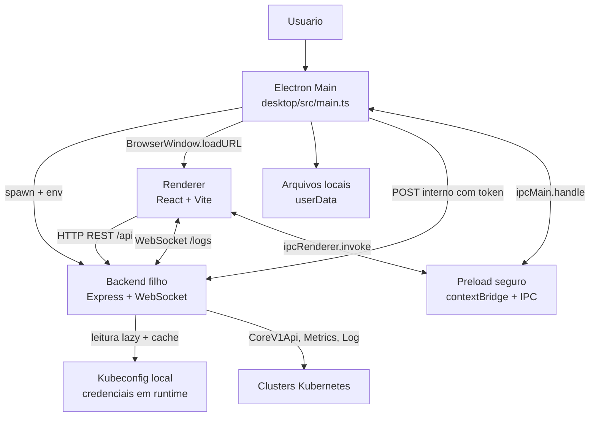
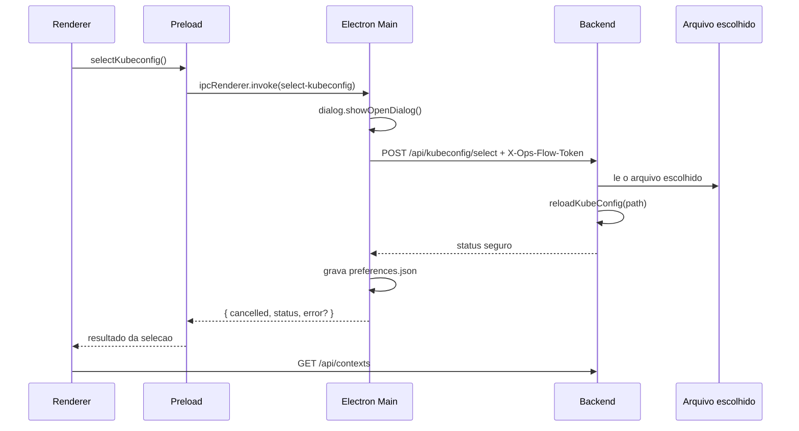

# ops-flow - Definicao tecnica do MVP Electron

> Documento de referencia da arquitetura e do comportamento de comunicacao do
> ops-flow v0.2.0.

## 1. Objetivo e escopo

O ops-flow e um aplicativo local, desktop e estritamente read-only para
inspecao de pods Kubernetes em varios contextos e namespaces.

A unidade de consulta do produto e o par:

```text
(contexto do kubeconfig, namespace)
```

O sistema permite:

- descobrir contextos do kubeconfig;
- descobrir namespaces disponiveis nos contextos selecionados;
- consultar pods em paralelo em varios alvos;
- agregar os resultados em uma tabela unica;
- abrir detalhes, eventos e metricas de um pod;
- acompanhar logs de um container por WebSocket;
- atualizar a lista de pods manualmente ou por polling configuravel;
- persistir presets e o caminho do kubeconfig localmente.

O sistema nao permite alterar o Kubernetes. Nao existem operacoes de create,
update, patch, replace, delete, restart, scale, exec, attach ou port-forward.

## 2. Resumo executivo

No modo desktop, existem tres camadas em processos distintos:

1. **Electron Main**: gerencia a janela, o ciclo de vida, o dialogo nativo de
   selecao de arquivo, o IPC e o processo filho do backend.
2. **Backend Node.js**: abre um servidor HTTP/WebSocket somente em localhost,
   serve o frontend compilado e e o unico componente que acessa o Kubernetes.
3. **Renderer React**: executa dentro da `BrowserWindow`, apresenta a interface
   e chama o backend por `fetch` e WebSocket. Nao tem acesso direto a Node.js ou
   ao filesystem.



### 2.1 Regra fundamental de comunicacao

O Electron **nao consulta o Kubernetes diretamente**.

O caminho sempre e:

```text
Renderer React
  -> HTTP ou WebSocket local
  -> Backend Node.js
  -> @kubernetes/client-node
  -> API do cluster Kubernetes
```

As excecoes sao as funcoes de desktop que realmente precisam do processo Main:

```text
Renderer
  -> preload/contextBridge
  -> IPC Electron
  -> Main
```

Essas funcoes sao a selecao nativa do kubeconfig e a persistencia de presets.

## 3. Componentes e responsabilidades

### 3.1 Processo Electron Main

Entrada compilada: [desktop/src/main.ts](desktop/src/main.ts)

Responsabilidades:

- impedir duas instancias simultaneas com `requestSingleInstanceLock()`;
- escolher uma porta TCP local disponivel;
- ler o caminho de kubeconfig salvo nas preferencias;
- gerar um token interno aleatorio para a rota de selecao de kubeconfig;
- iniciar e parar o backend como processo filho;
- aguardar o health check do backend antes de criar a janela;
- criar a `BrowserWindow` com isolamento de contexto e sandbox;
- carregar o frontend pela URL local do backend;
- responder aos handlers IPC;
- abrir o dialogo nativo de selecao de kubeconfig;
- salvar `preferences.json` e `presets.json` no diretorio `userData`;
- encerrar o backend quando a janela ou o processo desktop for encerrado.

Configuracao de seguranca da janela:

| Opcao | Valor | Efeito |
| --- | --- | --- |
| `contextIsolation` | `true` | Isola o codigo da pagina do contexto privilegiado |
| `nodeIntegration` | `false` | O renderer nao pode importar Node diretamente |
| `sandbox` | `true` | Restringe capacidades do renderer |
| `preload` | `desktop/dist/preload.js` | Expoe somente a ponte declarada |
| abertura de janela | negada | Links nao criam novas janelas Electron |

### 3.2 Preload

Entrada: [desktop/src/preload.ts](desktop/src/preload.ts)

O preload expoe apenas `window.opsFlowDesktop`:

```typescript
{
  isDesktop: true,
  platform: process.platform,
  selectKubeconfig(),
  loadPresets(),
  savePresets(presets)
}
```

Nao existe API generica de IPC, acesso a filesystem, execucao de comando ou
acesso a credenciais no renderer.

### 3.3 Backend

Entradas:

- [backend/src/index.ts](backend/src/index.ts): servidor HTTP e WebSocket;
- [backend/src/app.ts](backend/src/app.ts): Express, rotas e frontend estatico;
- [backend/src/config.ts](backend/src/config.ts): host, porta e variaveis locais;
- [backend/src/logsWebSocket.ts](backend/src/logsWebSocket.ts): upgrade e ciclo
  de vida do stream de logs.

O backend:

- escuta somente em `127.0.0.1`;
- usa a porta `OPS_FLOW_PORT`, ou `4000` fora do desktop;
- usa o mesmo servidor HTTP para o WebSocket;
- serve `frontend/dist` quando `OPS_FLOW_FRONTEND_DIST` esta definido;
- nao possui banco de dados;
- nao guarda credenciais em respostas ou logs;
- chama somente APIs de leitura do Kubernetes.

### 3.4 Renderer

Entradas principais:

- [frontend/src/main.tsx](frontend/src/main.tsx): montagem do React;
- [frontend/src/App.tsx](frontend/src/App.tsx): shell, health check e refresh;
- [frontend/src/api.ts](frontend/src/api.ts): cliente REST e construtor de URL
  WebSocket;
- [frontend/src/store.ts](frontend/src/store.ts): estado global Zustand;
- [frontend/src/components/TargetSelector.tsx](frontend/src/components/TargetSelector.tsx):
  contextos, namespaces, alvos e presets;
- [frontend/src/components/PodDetailsPanel.tsx](frontend/src/components/PodDetailsPanel.tsx):
  describe, metricas e logs;
- [frontend/src/components/LogViewer.tsx](frontend/src/components/LogViewer.tsx):
  consumo do stream de logs.

O renderer conhece somente os contratos normalizados. Ele nao recebe o objeto
bruto do kubeconfig nem conhece token, certificado ou chave.

## 4. Ciclo de vida do desktop

### 4.1 Inicializacao passo a passo

1. O Electron adquire o lock de instancia unica.
2. `app.whenReady()` chama `createMainWindow()`.
3. O Main resolve o diretorio raiz:
   - desenvolvimento: diretorio do repositorio;
   - empacotado: `process.resourcesPath`.
4. O Main define o diretorio do frontend compilado.
5. `availablePort()` reserva temporariamente uma porta em `127.0.0.1:0`,
   descobre o numero e libera a sonda.
6. O Main gera `internalToken` com 32 bytes aleatorios em hexadecimal.
7. `startBackend()` inicia `backend/dist/index.js` usando `process.execPath`.
8. O Main injeta no processo filho:

   ```text
   ELECTRON_RUN_AS_NODE=1
   OPS_FLOW_PORT=<porta escolhida>
   OPS_FLOW_FRONTEND_DIST=<diretorio frontend>
   OPS_FLOW_INTERNAL_TOKEN=<token efemero>
   OPS_FLOW_SELECTED_KUBECONFIG=<caminho salvo, quando houver>
   ```

9. `waitForBackend()` faz `GET /api/health` a cada 100 ms, por no maximo
   10 segundos.
10. Quando o health check responde HTTP 2xx, o Main cria a `BrowserWindow`.
11. A janela carrega `http://127.0.0.1:<porta>`.
12. O Express entrega `frontend/index.html` e os assets compilados.
13. O React monta e inicia seus efeitos de carregamento.

Se o backend nao responder em 10 segundos, a janela nao e criada; o Main fecha
o processo filho, mostra um erro nativo e encerra o Electron.

### 4.2 Encerramento

Ao fechar a janela:

1. o evento `close` e interceptado;
2. `shutdownApplication()` evita reentrada;
3. o Main envia `kill()` ao processo backend;
4. aguarda o evento de saida do filho;
5. destroi a janela e encerra o Electron.

`SIGINT` e `SIGTERM` seguem o mesmo fluxo. O WebSocket de logs tambem e
interrompido quando o processo backend termina.

### 4.3 Desenvolvimento web versus Electron

| Aspecto | Desenvolvimento web | Desktop empacotado ou `dev:desktop` |
| --- | --- | --- |
| Frontend | Vite em `http://localhost:5173` | Servido pelo Express local |
| Backend | Processo iniciado em separado, normalmente `:4000` | Filho do Electron em porta dinamica |
| Origem do renderer | Vite | `http://127.0.0.1:<porta>` |
| `/api` | Proxy Vite para `127.0.0.1:4000` | Mesma origem do backend |
| WebSocket | Proxy Vite com `ws: true` | Mesmo servidor HTTP do backend |
| Preload | Ausente no navegador | Injeta `window.opsFlowDesktop` |
| Presets | `localStorage` | `presets.json`, com fallback localStorage |
| Frontend estatico | Nao servido pelo backend | Express serve `frontend/dist` |

Configuracao do proxy de desenvolvimento: [frontend/vite.config.ts](frontend/vite.config.ts).

## 5. Canais de comunicacao

Existem cinco tipos de comunicacao no MVP:

1. Main Electron -> processo backend: `spawn` e variaveis de ambiente.
2. Renderer -> backend: HTTP REST local.
3. Renderer <-> backend: WebSocket local para logs.
4. Renderer <-> Main: IPC restrito via preload.
5. Backend -> Kubernetes: HTTPS usando o kubeconfig e as credenciais do usuario.

Tambem ha dois acessos auxiliares:

- Main -> backend: health check e selecao interna de kubeconfig;
- frontend -> Google Fonts: os links de fonte presentes no `index.html` podem
  acessar `fonts.googleapis.com` e `fonts.gstatic.com`.

Nao foi encontrada telemetria, analytics ou chamada para um servico de negocio
externo.

## 6. API HTTP exposta pelo backend

Base em desktop:

```text
http://127.0.0.1:<porta-dinamica>
```

Base no backend standalone:

```text
http://127.0.0.1:${OPS_FLOW_PORT:-4000}
```

O servidor fica acessivel para qualquer processo local que consiga acessar esse
loopback. Nao existe autenticacao de usuario ou multiusuario.

### 6.1 Tabela de endpoints

| Metodo | Rota | Chamador | Quando | Frequencia |
| --- | --- | --- | --- | --- |
| `GET` | `/api/health` | Main e App | inicializacao do backend e verificacao visual | Main: polling de 100 ms ate pronto; App: uma vez por montagem |
| `GET` | `/api/kubeconfig/status` | store | montar o seletor de alvos | uma vez por montagem logica |
| `GET` | `/api/contexts` | store | carregar, recarregar ou apos selecionar arquivo | montagem, botao Reload, retry ou apos selecao |
| `POST` | `/api/kubeconfig/select` | Main | confirmar arquivo no dialogo nativo | somente ao selecionar arquivo |
| `POST` | `/api/namespaces` | store | mudar o conjunto de contextos selecionados | uma vez por conjunto novo de contextos |
| `POST` | `/api/pods` | store | Fetch pods, retry ou refresh automatico | manual ou a cada 10, 30 ou 60 s |
| `GET` | `/api/pods/:cluster/:namespace/:pod/describe` | painel de detalhes | abrir outro pod | uma vez por pod aberto |
| `GET` | `/api/pods/:cluster/:namespace/:pod/metrics` | painel de detalhes | abrir outro pod | uma vez por pod aberto |

Os segmentos `cluster`, `namespace` e `pod` sao codificados com
`encodeURIComponent` no frontend.

### 6.2 `GET /api/health`

Resposta normal:

```json
{
  "status": "ok",
  "service": "ops-flow-backend",
  "readOnly": true
}
```

Essa rota nao consulta Kubernetes. Ela apenas confirma que o processo backend
esta ouvindo.

### 6.3 `GET /api/kubeconfig/status`

Resposta possivel:

```json
{
  "available": true,
  "source": "environment",
  "contextCount": 2
}
```

`source` pode ser:

- `environment`: `KUBECONFIG` foi usado;
- `selected`: o arquivo foi selecionado pelo usuario ou veio de
  `OPS_FLOW_SELECTED_KUBECONFIG`;
- `default`: caminho padrao, normalmente `~/.kube/config`.

Em erro, o endpoint omite `contextCount` e retorna somente metadados seguros:

```json
{
  "available": false,
  "source": "default"
}
```

O caminho real do arquivo nunca e retornado.

### 6.4 `GET /api/contexts`

Consulta `KubeConfig.getContexts()` e retorna somente nomes e metadados publicos:

```json
{
  "contexts": [
    {
      "name": "kubernetes-qa-tb",
      "cluster": "cluster-name",
      "namespace": "default"
    }
  ]
}
```

Token, certificado, chave, URL privada e demais campos de autenticacao do
kubeconfig nao entram na resposta.

### 6.5 `POST /api/namespaces`

Request:

```json
{
  "clusters": ["kubernetes-qa-tb", "kubernetes-qa-gt"]
}
```

Resposta:

```json
{
  "namespaces": [
    {
      "name": "bank-overdraft",
      "clusters": ["kubernetes-qa-gt", "kubernetes-qa-tb"]
    }
  ],
  "errors": []
}
```

Embora seja `POST`, a operacao e somente de leitura. O uso de `POST` existe
para transportar uma lista de contextos no corpo.

Internamente:

1. valida e normaliza a lista;
2. remove contextos duplicados;
3. executa `listNamespace()` em paralelo, um por contexto;
4. agrupa namespaces de mesmo nome;
5. anota em quais contextos cada namespace existe;
6. preserva falhas por contexto em `errors`.

### 6.6 `POST /api/pods`

Request:

```json
{
  "targets": [
    { "cluster": "kubernetes-qa-tb", "namespace": "bank-overdraft" },
    { "cluster": "kubernetes-qa-gt", "namespace": "bank-overdraft" }
  ]
}
```

Resposta agregada:

```json
{
  "pods": [
    {
      "cluster": "kubernetes-qa-tb",
      "namespace": "bank-overdraft",
      "name": "api-7c8d6f9c6b-x2abc",
      "status": "Running",
      "ready": "2/2",
      "restarts": 0,
      "node": "node-a",
      "ageSeconds": 3600,
      "containers": ["app", "istio-proxy"]
    }
  ],
  "errors": []
}
```

Internamente:

1. valida cada par `cluster` + `namespace`;
2. inicia `listNamespacedPod({ namespace })` para todos os alvos em paralelo;
3. espera com `Promise.allSettled()`;
4. normaliza cada pod;
5. preserva o contexto e namespace de origem em cada item;
6. retorna pods bem-sucedidos e erros por alvo.

Uma falha de cluster nao cancela os demais alvos.

### 6.7 `GET .../describe`

Rota:

```text
GET /api/pods/:cluster/:namespace/:pod/describe
```

Para um pod, o backend faz:

1. `readNamespacedPod({ name, namespace })`;
2. `listNamespacedEvent({ namespace, fieldSelector: "involvedObject.name=<pod>" })`;
3. normalizacao de status, node, IP, QoS, service account, data de criacao,
   labels, annotations, conditions e containers;
4. ordenacao dos eventos do mais novo para o mais antigo.

Se a leitura de eventos falhar por falta de permissao, o describe principal
continua e a resposta inclui `eventsError`.

Status HTTP tratado pela rota:

- `400`: parametros ausentes;
- `403`: permissao negada no cluster;
- `404`: pod inexistente;
- `502`: outro erro upstream do Kubernetes.

### 6.8 `GET .../metrics`

Rota:

```text
GET /api/pods/:cluster/:namespace/:pod/metrics
```

O backend chama `metrics.getPodMetrics(namespace)`, encontra o pod pelo nome e
retorna uso por container:

```json
{
  "available": true,
  "window": "30s",
  "timestamp": "2026-09-15T12:00:00Z",
  "containers": [
    { "name": "app", "cpu": "25m", "memory": "64Mi" }
  ]
}
```

Ausencia do `metrics-server`, recurso ainda nao disponivel ou erro conhecido da
API de metricas nao vira falha HTTP. Vira:

```json
{
  "available": false,
  "reason": "This cluster does not expose the metrics API (metrics-server missing)."
}
```

Assim, describe e logs continuam usaveis sem metrics-server.

### 6.9 Servir o frontend

Quando `OPS_FLOW_FRONTEND_DIST` esta definido, o backend:

- serve os assets estaticos;
- responde `index.html` para rotas que nao comecam com `/api/`;
- nao trata uma rota `/api/*` desconhecida como pagina SPA.

Esse e o caminho usado pelo desktop empacotado.

## 7. WebSocket de logs

### 7.1 Abertura

Rota:

```text
WS /api/pods/:cluster/:namespace/:pod/logs?container=app&follow=true&tailLines=500
```

O frontend usa:

- `ws://` quando a pagina usa HTTP;
- `wss://` quando a pagina usa HTTPS.

No desktop atual a pagina usa HTTP local, portanto a URL efetiva e `ws://`.

Parametros:

| Parametro | Obrigatorio | Padrao | Limite |
| --- | --- | --- | --- |
| `container` | sim | nenhum | nome do container |
| `follow` | nao | `true` | `false` encerra apos o backlog |
| `tailLines` | nao | `500` | maximo `5000` |

O backend aceita upgrade somente no caminho exato. Outro upgrade recebe `404` e
o socket e destruido.

### 7.2 Mensagens servidor -> renderer

Inicio:

```json
{ "type": "started", "container": "app" }
```

Cada linha:

```json
{ "type": "line", "line": "2026-09-15 request completed" }
```

Erro:

```json
{ "type": "error", "message": "mensagem sanitizada" }
```

Fim:

```json
{ "type": "end" }
```

### 7.3 Ciclo de vida do stream

1. Ao abrir o painel de detalhes, a aba inicial e `Describe`; o WebSocket so e
   criado quando a aba `Logs` e montada.
2. O renderer abre um socket para o primeiro container do pod.
3. Ao trocar de container, o socket anterior e fechado e um novo e criado.
4. Ao fechar ou trocar de pod, o efeito React fecha o socket.
5. O backend recebe `close` ou `error`, aborta a requisicao de logs no cluster e
   libera o stream.
6. Com `follow=true`, o socket permanece aberto enquanto o container produzir
   logs.
7. Erro de leitura envia `error` e encerra a conexao.
8. Com `follow=false`, `end` e enviado e a conexao e fechada.

Configuracoes do viewer:

- recebe inicialmente ate 500 linhas;
- mantem no maximo 5.000 linhas no frontend;
- pausar interrompe o append local, mas mantem o socket aberto;
- linhas recebidas durante a pausa sao descartadas;
- nao existe reconexao automatica;
- filtro e auto-scroll sao operacoes locais, sem novas chamadas ao backend.

## 8. Chamadas IPC do Electron

### 8.1 Handlers registrados no Main

Em [desktop/src/main.ts](desktop/src/main.ts), existem exatamente tres handlers:

| Canal | Renderer chama | Main faz | Momento |
| --- | --- | --- | --- |
| `select-kubeconfig` | `window.opsFlowDesktop.selectKubeconfig()` | abre dialogo, chama rota interna e salva preferencia | clique no botao de selecionar arquivo |
| `load-presets` | `window.opsFlowDesktop.loadPresets()` | le e valida `presets.json` | hidratacao inicial do frontend |
| `save-presets` | `window.opsFlowDesktop.savePresets(presets)` | valida e grava `presets.json` | criar, editar ou apagar preset |

O renderer nao envia token para a rota de selecao. O token fica somente no Main.

### 8.2 Selecao de kubeconfig

Fluxo completo:



Detalhes de erro:

- cancelamento no dialogo nao altera o estado;
- token ausente ou incorreto recebe `404 Not found`;
- arquivo invalido recebe `400` e nao substitui a configuracao anterior;
- se o backend aceitar o arquivo, mas a preferencia nao puder ser gravada, o
  resultado volta com `status` e `error` para indicar que a sessao funciona,
  mas a escolha nao foi persistida.

### 8.3 Presets

No desktop, `loadPersistentPresets()` usa IPC e o arquivo:

```text
<app.getPath('userData')>/presets.json
```

O arquivo contem apenas:

```json
[
  {
    "id": "...",
    "name": "QA overdraft",
    "description": "...",
    "targets": [
      { "cluster": "kubernetes-qa-tb", "namespace": "bank-overdraft" }
    ]
  }
]
```

Ao salvar, o frontend primeiro tenta `localStorage` e, se estiver no desktop,
tambem dispara `save-presets` sem bloquear a interface. O carregamento inicial
do desktop prefere `presets.json`; se falhar, cai para `localStorage`.

Na web, sem preload, somente `localStorage` e usado com a chave
`ops-flow.presets.v1`.

### 8.4 Arquivos locais do Main

| Arquivo | Conteudo | Leitura | Escrita |
| --- | --- | --- | --- |
| `preferences.json` | caminho selecionado do kubeconfig | inicializacao | apos selecao bem-sucedida |
| `presets.json` | ids, nomes, descricoes e pares cluster/namespace | hidratacao | cada alteracao de preset |

O caminho de `userData` e definido pelo Electron, normalmente:

- Linux: `~/.config/ops-flow/`;
- Windows: `%APPDATA%/ops-flow/`;
- macOS: `~/Library/Application Support/ops-flow/`.

Credenciais, tokens, certificados e conteudo do kubeconfig nao sao persistidos
por esses mecanismos.

## 9. Fluxos de tela, gatilhos e frequencias

### 9.1 Entrada da tela

Ao montar a interface, as acoes logicas sao:

1. `hydratePresets()` carrega presets persistidos;
2. `loadContexts()` faz `GET /api/contexts`;
3. `loadKubeconfigStatus()` faz `GET /api/kubeconfig/status`;
4. o App faz `GET /api/health` para o indicador visual.

Essas chamadas podem ocorrer em paralelo.

Como [frontend/src/main.tsx](frontend/src/main.tsx) usa `StrictMode`, efeitos de
montagem podem ser executados duas vezes pelo React em desenvolvimento. Isso
pode duplicar chamadas iniciais observadas no DevTools; nao representa um
polling de producao e nao altera a frequencia do auto-refresh.

### 9.2 Selecao de contextos

Ao selecionar ou remover um contexto:

1. o estado local de namespaces selecionados e limpo;
2. o campo de namespace e limpo;
3. `NamespaceInput` detecta a nova chave de contextos;
4. o store faz `POST /api/namespaces`;
5. a resposta preenche o autocomplete.

O store ordena a lista para comparar conjuntos e evita nova chamada quando o
mesmo conjunto ja foi carregado sem erro.

### 9.3 Adicao de alvos

Depois que o usuario seleciona namespaces validos, o frontend cria um alvo para
cada combinacao disponivel:

```text
cada contexto selecionado x cada namespace selecionado
```

Pares duplicados sao ignorados. Adicionar ou remover alvos nao consulta pods
automaticamente. A consulta so ocorre no botao `Fetch pods` ou no timer de
auto-refresh.

### 9.4 Consulta manual de pods

Gatilhos:

- clique em `Fetch pods`;
- clique em `Refresh now`;
- retry apos erro.

Efeito:

1. envia um unico `POST /api/pods` contendo todos os alvos atuais;
2. backend consulta todos os alvos em paralelo;
3. frontend substitui a tabela pelo resultado agregado;
4. erros individuais aparecem no banner de alvo;
5. `lastUpdatedAt` recebe o horario local de conclusao.

O frontend usa ids de requisicao, revisao de configuracao e assinatura dos
alvos para ignorar respostas antigas que chegarem depois de uma nova selecao.
As requisicoes HTTP antigas nao sao abortadas no browser, mas suas respostas
nao conseguem sobrescrever o estado atual.

### 9.5 Auto-refresh de pods

Opcoes disponiveis:

| Valor | Comportamento |
| --- | --- |
| `manual` / `0` | desativado |
| `10s` | um `POST /api/pods` a cada 10 segundos |
| `30s` | um `POST /api/pods` a cada 30 segundos |
| `60s` | um `POST /api/pods` a cada 60 segundos |

O timer existe somente quando ha pelo menos um alvo. A atualizacao automatica
usa `silent: true`: preserva a tabela visivel e mostra apenas o estado de
refresh. O timer e desmontado ao mudar o intervalo, remover todos os alvos ou
desmontar o componente.

O intervalo de 10 segundos em `ViewToolbar` para atualizar o texto relativo
`"12s ago"` e somente local. Ele nao faz nenhuma chamada de rede.

### 9.6 Abertura do painel de detalhes

Ao clicar em uma linha da tabela:

1. o frontend guarda `{ cluster, namespace, name, containers }`;
2. abre o painel lateral;
3. dispara em paralelo:
   - `GET .../describe`;
   - `GET .../metrics`;
4. espera os dois resultados com `Promise.allSettled()`;
5. mostra cada erro na sua aba, sem impedir a outra.

Isso ocorre uma vez para cada pod aberto. Trocar de aba entre Describe e Metrics
nao repete as chamadas. O filtro, agrupamento e redimensionamento sao locais.

### 9.7 Abertura da aba Logs

Ao montar a aba Logs:

1. escolhe o primeiro container do pod;
2. abre um WebSocket com `follow=true` e `tailLines=500`;
3. acrescenta cada mensagem `line` ao buffer local;
4. ao trocar o container, reinicia o socket e limpa o buffer;
5. ao fechar o painel, fecha o socket.

Pausar, limpar, filtrar e alterar auto-scroll nao geram novas chamadas.

## 10. Backend e Kubernetes

### 10.1 Resolucao do kubeconfig

O backend resolve a configuracao nesta ordem:

1. arquivo escolhido pelo usuario, quando existe um caminho selecionado;
2. `KUBECONFIG`, que pode conter varios arquivos separados por `:` no Linux ou
   `;` no Windows;
3. caminho padrao, normalmente `~/.kube/config`.

No desktop, o caminho salvo em `preferences.json` e passado como
`OPS_FLOW_SELECTED_KUBECONFIG` na inicializacao seguinte.

O kubeconfig e carregado sob demanda e fica em memoria. `reloadKubeConfig()` so
substitui a configuracao depois de conseguir carregar a nova; em caso de erro,
a configuracao anterior continua ativa.

### 10.2 Cache de clientes

O modulo [backend/src/kube/kubeconfig.ts](backend/src/kube/kubeconfig.ts) mantem
em memoria, por contexto:

- `KubeConfig` escopado;
- `CoreV1Api`;
- `Metrics`;
- `Log`.

Cada contexto recebe uma copia de `KubeConfig` com `currentContext` proprio.
Isso evita que consultas concorrentes de contextos diferentes alterem um
contexto global compartilhado.

Ao selecionar outro kubeconfig, todos esses caches sao limpos.

### 10.3 Operacoes Kubernetes efetivamente usadas

| Servico | Chamada Kubernetes | Finalidade | Leitura |
| --- | --- | --- | --- |
| kubeconfig | `getContexts()` | listar contextos | sim |
| namespaces | `listNamespace()` | autocomplete e cobertura | sim |
| pods | `listNamespacedPod({ namespace })` | tabela principal | sim |
| describe | `readNamespacedPod({ namespace, name })` | detalhes do pod | sim |
| describe | `listNamespacedEvent(...)` | eventos do pod | sim |
| metricas | `getPodMetrics(namespace)` | CPU e memoria | sim |
| logs | `Log.log(namespace, pod, container, stream, options)` | stream de logs | sim |

Nao sao importadas as classes `Exec`, `Attach`, `PortForward` ou `Cp`.

### 10.4 Fan-out e falhas parciais

Namespaces e pods usam `Promise.allSettled()`.

Consequencias:

- um cluster indisponivel nao cancela os outros;
- a resposta contem dados parciais quando possivel;
- cada falha e associada ao cluster ou alvo que falhou;
- erros do cliente Kubernetes sao sanitizados antes de chegar ao renderer.

Nao ha retry, timeout ou circuit breaker explicito nas chamadas ao Kubernetes.

### 10.5 TLS e cadeia de CA

Ao criar um contexto escopado, o backend pode complementar a CA presente no
kubeconfig com um bundle de CAs do sistema. Os caminhos conhecidos incluem:

- `/etc/ssl/certs/ca-certificates.crt`;
- `/etc/pki/tls/certs/ca-bundle.crt`.

O bundle e somente lido em memoria e cacheado. A verificacao TLS continua
ativada. O projeto nao usa `skipTLSVerify` nem
`NODE_TLS_REJECT_UNAUTHORIZED`.

### 10.6 Autenticacao do cluster

O backend delega a autenticacao ao kubeconfig do usuario. Isso inclui tokens,
certificados, chaves e, quando configurado, um executavel de autenticacao `exec`
que precisa existir no `PATH` da maquina.

Esses dados sao consumidos pelo cliente Kubernetes em runtime e nao sao
retornados pelo backend.

## 11. O que fica exposto

### 11.1 Exposicao de rede

O backend escuta em `127.0.0.1`, nao em `0.0.0.0`. Portanto, a API nao e
publicada diretamente na rede local.

Ainda assim, qualquer processo local com acesso ao loopback pode tentar chamar
as rotas publicas. O MVP nao possui autenticacao propria para consultas.

A rota `POST /api/kubeconfig/select` e uma excecao: exige o header
`X-Ops-Flow-Token` com o token efemero compartilhado entre Main e backend.
Esse token nao e exposto ao renderer.

### 11.2 Dados retornados

Retornam ao renderer:

- nomes e metadados dos contextos;
- nomes de namespaces e contextos onde existem;
- pods normalizados;
- detalhes e eventos de um pod;
- uso de CPU e memoria quando disponivel;
- linhas de log do container selecionado;
- mensagens sanitizadas de erro.

Nao retornam:

- tokens de acesso;
- client certificates;
- private keys;
- `caData` ou bundle de CA;
- headers de autenticacao;
- caminho do kubeconfig no endpoint de status;
- conteudo de Secrets do Kubernetes.

### 11.3 Politica read-only

O `POST` de pods, namespaces e selecao de kubeconfig nao significa mutacao do
cluster. Sao consultas com payload no corpo, recarga de configuracao local ou
operacao de leitura.

As unicas chamadas de API Kubernetes usadas no MVP estao listadas na secao
[10.3](#103-operacoes-kubernetes-efetivamente-usadas), todas de leitura.

## 12. Build e distribuicao

O monorepo usa npm workspaces:

```text
ops-flow/
  backend/   Node + TypeScript -> backend/dist
  frontend/  React + Vite -> frontend/dist
  desktop/   Electron + TypeScript -> desktop/dist
```

Build completo:

```text
npm run build
  -> backend build
  -> frontend build
  -> desktop build
```

Empacotamento:

1. executa o build dos tres workspaces;
2. `prepare-desktop-runtime.mjs` copia `backend/package.json`;
3. instala somente dependencias de producao do backend;
4. rejeita caminhos sensiveis `.kube` e `kubeconfig` nos artefatos;
5. `electron-builder` inclui:
   - `desktop/dist/**` como codigo Electron;
   - `frontend/dist` em `resources/frontend`;
   - `backend/dist` em `resources/backend/dist`;
   - `backend/package.json`;
   - runtime de `backend/node_modules`.

O backend fica fora do ASAR para resolver suas dependencias. O instalador nao
inclui o kubeconfig do usuario.

## 13. Linha do tempo dos cenarios principais

### 13.1 Abrir o aplicativo

```text
Electron Main
  -> escolhe porta
  -> inicia backend
  -> GET /api/health em loop de prontidao
  -> cria BrowserWindow
  -> renderer carrega pela origem local
  -> health visual + status kubeconfig + contexts + presets
```

### 13.2 Consultar pods

```text
Usuario seleciona contextos
  -> POST /api/namespaces
  -> usuario seleciona namespaces
  -> frontend monta pares (contexto, namespace)
  -> usuario clica Fetch pods
  -> POST /api/pods
  -> listNamespacedPod em paralelo
  -> normalizePod
  -> resposta pods + errors
  -> tabela unificada
```

### 13.3 Investigar um pod

```text
Clique na linha
  -> GET describe
  -> GET metrics                 (paralelo)
  -> painel de detalhes
  -> aba Logs
  -> WS /logs
  -> linhas incrementais
```

### 13.4 Trocar kubeconfig

```text
Clique no seletor
  -> IPC para Main
  -> dialogo nativo
  -> POST /api/kubeconfig/select com token interno
  -> reload + limpa caches backend
  -> grava preferences.json
  -> limpa estado de targets/pods no renderer
  -> GET /api/contexts
```

## 14. Estados e protecao contra respostas antigas

O store mantem contadores de requisicao para namespaces e pods.

Ao trocar kubeconfig:

- incrementa a revisao da configuracao;
- invalida requisicoes de namespaces e pods em andamento;
- limpa targets, namespaces, pods e erros;
- recarrega contextos.

Ao trocar os alvos durante uma consulta:

- uma assinatura dos alvos e comparada na conclusao;
- uma resposta de uma selecao anterior e ignorada.

Ao trocar o pod no painel:

- o efeito usa uma flag `active`;
- respostas de um pod anterior nao atualizam o painel atual.

Ao trocar container ou desmontar o LogViewer:

- o socket anterior e fechado;
- o backend aborta o stream Kubernetes correspondente.

## 15. Limites conhecidos do comportamento atual

- O backend nao implementa retry, timeout ou circuit breaker Kubernetes.
- O viewer de logs nao reconecta sozinho.
- Linhas recebidas enquanto o viewer esta pausado sao descartadas.
- O buffer local de logs limita-se a 5.000 linhas.
- Metricas dependem do `metrics-server` de cada cluster.
- Presets dependem do diretorio de dados do Electron no desktop e do
  `localStorage` no modo web.
- O backend local nao tem autenticacao geral nem modelo multiusuario.
- O intervalo configurado atualiza somente pods; describe, metricas e logs nao
  entram no auto-refresh.
- A lista de namespaces e cacheada no frontend por conjunto de contextos, mas
  nao possui cache persistente nem TTL no backend.
- A pagina inclui fontes do Google Fonts; em ambiente sem rede, o sistema usa o
  comportamento de carregamento/fallback do navegador.

## 16. Referencias de implementacao

Arquivos que controlam diretamente este comportamento:

- [desktop/src/main.ts](desktop/src/main.ts)
- [desktop/src/backendProcess.ts](desktop/src/backendProcess.ts)
- [desktop/src/preload.ts](desktop/src/preload.ts)
- [backend/src/index.ts](backend/src/index.ts)
- [backend/src/app.ts](backend/src/app.ts)
- [backend/src/logsWebSocket.ts](backend/src/logsWebSocket.ts)
- [backend/src/routes/contexts.ts](backend/src/routes/contexts.ts)
- [backend/src/routes/kubeconfig.ts](backend/src/routes/kubeconfig.ts)
- [backend/src/routes/namespaces.ts](backend/src/routes/namespaces.ts)
- [backend/src/routes/pods.ts](backend/src/routes/pods.ts)
- [backend/src/kube/kubeconfig.ts](backend/src/kube/kubeconfig.ts)
- [backend/src/kube/kubeconfigDiscovery.ts](backend/src/kube/kubeconfigDiscovery.ts)
- [backend/src/kube/namespacesService.ts](backend/src/kube/namespacesService.ts)
- [backend/src/kube/podsService.ts](backend/src/kube/podsService.ts)
- [backend/src/kube/podDetailsService.ts](backend/src/kube/podDetailsService.ts)
- [backend/src/kube/logsService.ts](backend/src/kube/logsService.ts)
- [frontend/src/api.ts](frontend/src/api.ts)
- [frontend/src/store.ts](frontend/src/store.ts)
- [frontend/src/App.tsx](frontend/src/App.tsx)
- [frontend/src/presets.ts](frontend/src/presets.ts)
- [frontend/src/components/TargetSelector.tsx](frontend/src/components/TargetSelector.tsx)
- [frontend/src/components/PodDetailsPanel.tsx](frontend/src/components/PodDetailsPanel.tsx)
- [frontend/src/components/LogViewer.tsx](frontend/src/components/LogViewer.tsx)
- [electron-builder.yml](electron-builder.yml)
- [scripts/prepare-desktop-runtime.mjs](scripts/prepare-desktop-runtime.mjs)
