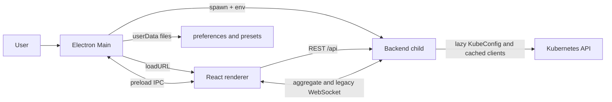

# ops-union v1.4.0 Architecture Audit

## Audit date, scope, and executive summary

**Date:** 2026-09-18
**Environment:** Linux, Node v25.2.1, npm 11.6.2, workspace `/home/idd_galcantara/Documents/ops-flow`
**Scope:** Read-only review of the current checkout at `main`, tagged `v1.3.2` (`0beac3e`), covering package/process topology, ownership, REST/WebSocket/IPC contracts, Kubernetes access, persistence, lifecycle, security, resource limits, tests, documentation, and operational gaps.

The current architecture is a three-process desktop flow: Electron Main starts a local backend child, the backend is the only Kubernetes client, and the sandboxed React renderer uses REST/WebSocket plus a narrow preload bridge. The implementation has strong focused coverage for backend fan-out, safe errors, live/history logs, bounded history storage, stale history generations, and renderer state utilities. Backend and frontend tests passed, and all three package typechecks passed.

The highest-value risks are at boundaries rather than in the core happy path:

1. A malformed percent-encoded legacy log WebSocket path reaches uncaught `decodeURIComponent` calls and can terminate the backend process.
2. REST target and namespace fan-out has no explicit request cardinality or concurrency bound; the log/history paths have limits, but ordinary discovery/query fan-out does not.
3. Backend termination is not graceful. Electron sends `SIGTERM`, while the backend relies on process exit and startup orphan cleanup, so history files can remain until the one-hour orphan grace period.
4. The local backend and WebSocket have no client authentication. Binding to loopback limits network exposure, but any local process can issue read requests using the backend's kubeconfig privileges.
5. Context loading has no request/revision guard, unlike namespace and pod loading, so a response from before kubeconfig replacement can overwrite the newly selected context list.

These are review findings, not implemented fixes. No product source, test, manifest, generated artifact, release artifact, Kubernetes resource, kubeconfig, or current context was changed by this audit. No requirements or design correction was necessary.

## Repository and process map

### Package topology

| Package/process | Entry points and ownership | Runtime boundary | Validation surface |
| --- | --- | --- | --- |
| Root npm workspace | [package.json](../../package.json) | Orchestrates `dev`, `build`, `typecheck`, and packaging scripts | Root typecheck delegates to all workspaces |
| Backend | [backend/src/index.ts](../../backend/src/index.ts), [backend/src/app.ts](../../backend/src/app.ts) | Node child or standalone process; localhost HTTP and WebSocket; sole Kubernetes access | 88 backend tests passed; typecheck passed |
| Kubernetes adapters | [backend/src/kube/kubeconfig.ts](../../backend/src/kube/kubeconfig.ts), services under [backend/src/kube](../../backend/src/kube) | Kubeconfig credentials remain in backend memory; clients are cached per context | Focused unit tests for discovery, normalization, fan-out, logs, metrics behavior |
| Renderer | [frontend/src/main.tsx](../../frontend/src/main.tsx), [frontend/src/App.tsx](../../frontend/src/App.tsx), [frontend/src/store.ts](../../frontend/src/store.ts) | Browser or Electron renderer; no direct Node or filesystem access | 105 frontend tests passed; typecheck passed |
| REST/WebSocket client | [frontend/src/api.ts](../../frontend/src/api.ts), [frontend/src/components/LogViewer.tsx](../../frontend/src/components/LogViewer.tsx) | Renderer to backend HTTP and one aggregate log WebSocket | Serializer, cache, state, and history tests; no browser/Electron E2E suite |
| Electron Main | [desktop/src/main.ts](../../desktop/src/main.ts) | Privileged process; owns window, child process, native dialog, IPC, and userData files | No desktop test script; typecheck passed |
| Preload bridge | [desktop/src/preload.ts](../../desktop/src/preload.ts), [frontend/src/vite-env.d.ts](../../frontend/src/vite-env.d.ts) | `contextBridge` exposes typed application-specific methods | Type declarations only; no IPC integration tests |
| Packaging/runtime | [electron-builder.yml](../../electron-builder.yml), [scripts/prepare-desktop-runtime.mjs](../../scripts/prepare-desktop-runtime.mjs), [release](../../release) | Compiled frontend/backend and Electron resources; release files are existing generated/runtime artifacts | Packaging was not run by this audit |

### Runtime topology

### Ownership and boundary matrix

| Responsibility | Owner | Contract or state | Boundary observation |
| --- | --- | --- | --- |
| Process startup and shutdown | Electron Main, with backend server bootstrap | Child process, health polling, `SIGINT`/`SIGTERM`, window close | Main owns child termination; backend does not install signal handlers |
| Kubeconfig discovery and selected file | Backend kubeconfig module, initiated by Main dialog | `KubeConfigStatus`, context names, internal selection POST | Backend owns credential use; Main owns path preference and dialog |
| Target selection and query state | Renderer Zustand store and selector | `Target[]`, request IDs, configuration revision | Renderer owns selection; backend validates request shape |
| Pod/namespace fan-out | Backend services | `Promise.allSettled`, normalized responses, per-target errors | Backend owns parallelism but has no explicit target cardinality cap |
| Details and metrics | Backend pod details service, renderer details panel | REST payloads and `Promise.allSettled` UI loading | Metrics absence is a normal `{ available: false }` result |
| Live logs | Backend log WebSocket/subscription and renderer `LogViewer` | Aggregate events, bounded line/byte limits | One aggregate socket; legacy per-pod socket remains separate |
| History logs | Backend `HistorySessionManager` and renderer history runtime | Temporary NDJSON/index, generation and snapshot identity | Backend owns storage and limits; renderer owns bounded window caches |
| Presets and theme | Main userData persistence plus renderer localStorage fallback | IPC methods and JSON files | Two persistence stores are written in desktop mode; writes are fire-and-forget from renderer |
| Renderer privilege boundary | Electron BrowserWindow and preload | `contextIsolation`, `nodeIntegration: false`, `sandbox`, narrow bridge | No generic IPC, filesystem, command execution, or direct kubeconfig access |

## Required runtime and data-flow traces

### Startup and shutdown

1. `app.whenReady()` calls `createMainWindow()` in [desktop/src/main.ts](../../desktop/src/main.ts).
2. Main resolves the project/resource root, selects a free loopback port, reads the saved kubeconfig path, generates a random internal token, and calls `startBackend()`.
3. [desktop/src/backendProcess.ts](../../desktop/src/backendProcess.ts) spawns `backend/dist/index.js` with `OPS_FLOW_PORT`, frontend distribution, internal token, and optional selected kubeconfig path.
4. Main polls `/api/health` for up to ten seconds before creating a `BrowserWindow` with context isolation, disabled Node integration, sandboxing, and the preload bridge.
5. The renderer mounts and starts health, kubeconfig, context, preset, and refresh effects. The backend serves the compiled frontend when `OPS_FLOW_FRONTEND_DIST` is set.
6. Window close and Main signals call `shutdownApplication()`, which calls `stopBackend()` and then destroys the window. `stopBackend()` sends `kill()` and waits for the child exit event without a timeout.
7. The backend attaches history cleanup to HTTP server `close`. It does not install a signal handler that calls `server.close()` or `HistorySessionManager.close()`. On ordinary process termination, orphaned history storage is recovered only by the next manager startup after the configured `orphanGraceMs` of one hour.

**Observed behavior:** startup health gating and server-close history cleanup are tested. **Gap:** child shutdown timeout and backend signal cleanup are not tested.

### Kubeconfig and context discovery

1. The backend lazily resolves `KUBECONFIG`, a selected path, or the platform default in [backend/src/kube/kubeconfigDiscovery.ts](../../backend/src/kube/kubeconfigDiscovery.ts).
2. `getKubeConfig()` loads once; `listContexts()` returns only context, cluster, and optional namespace names. KubeConfig status returns availability, source, and context count without the path.
3. `scopedConfigForContext()` clones context/cluster/user data, selects one context, completes the CA chain, and caches scoped config plus Core API, metrics, and log clients per context.
4. Desktop selection is initiated by the renderer through preload IPC, handled by Main's native file dialog, and sent to the backend `POST /api/kubeconfig/select` with an ephemeral internal header token. A failed reload leaves the existing config and clients intact.
5. The renderer clears targets and query state after a successful selection, increments `configurationRevision`, and reloads contexts.

**Security evidence:** route tests assert that selected paths, kubeconfig tokens, invalid content, and Kubernetes error headers do not appear in responses. **Boundary gap:** context response loading itself has no revision guard.

### Target to pod query and namespace discovery

1. [frontend/src/components/TargetSelector.tsx](../../frontend/src/components/TargetSelector.tsx) loads contexts on mount and after manual reload, and loads namespaces when the selected cluster set changes.
2. The renderer sends `POST /api/namespaces` with cluster names and `POST /api/pods` with `(cluster, namespace)` targets through [frontend/src/api.ts](../../frontend/src/api.ts).
3. Backend route validators trim and shape inputs. Namespace service deduplicates clusters, runs `listNamespace()` in parallel, merges names, and returns per-cluster errors. Pod service runs `listNamespacedPod()` for each target, normalizes origin/status/readiness/application identity, and returns per-target errors.
4. Namespace and pod store requests capture request IDs and configuration/target signatures. Responses from an obsolete request are ignored. `loadContexts()` does not use the same guard.

**Read-only evidence:** only namespace and pod list methods are called. **Resource observation:** target and cluster arrays have no explicit maximum or concurrency scheduler; `Promise.allSettled` creates one operation per accepted item.

### Pod details and metrics

1. Opening a pod sets local selection state in [frontend/src/App.tsx](../../frontend/src/App.tsx) and mounts [frontend/src/components/PodDetailsPanel.tsx](../../frontend/src/components/PodDetailsPanel.tsx).
2. The panel requests describe and metrics concurrently with `Promise.allSettled`, keeps only results for the active pod, and displays independent errors.
3. Backend describe reads the pod and then lists namespace events, preserving the pod result if event access fails. Metrics reads `metrics.k8s.io`; missing/unsupported metrics returns `available: false`, while other failures are surfaced as safe reasons.

**Observed behavior:** describe/metrics paths are read-only and metrics-server absence is explicitly degraded. Focused backend service tests cover detection, but no browser/Electron test verifies panel rendering or cross-request behavior.

### Live logs

1. The renderer derives exact source tuples from selected pods and opens one aggregate WebSocket at `/api/logs` through [frontend/src/components/LogViewer.tsx](../../frontend/src/components/LogViewer.tsx).
2. The renderer sends a `subscribe` message containing source tuples, applied range, follow state, and limits. The backend validates dates, sources, duplicate tuples, source count, and per-source/aggregate limits.
3. `startLogSubscription()` starts one structured read per source, tracks source counters/sequences, isolates source failures, stops sources on aggregate limits, and emits a summary. `streamStructuredPodLogs()` parses bounded lines, applies time boundaries, and aborts the Kubernetes log controller on stop.
4. The renderer tracks source state, keeps at most `CLIENT_LOG_BUFFER` records subject to accepted limits, filters locally, virtualizes rows, and closes/replaces the socket in the effect cleanup. History replacement sends an explicit cancel first when possible.
5. A legacy per-pod WebSocket remains at `/api/pods/:cluster/:namespace/:pod/logs`; it decodes URL segments, requires a container, and stops the stream on socket close/error.

**Observed behavior:** backend protocol, subscription, stream, WebSocket, and frontend log-session tests pass. **Finding:** malformed URL decoding is not isolated before the legacy handler reaches `decodeURIComponent`.

### History logs

1. History uses the same aggregate socket and sends `history.start` with a request ID, generation, range, and exact sources.
2. `HistorySessionManager` enforces concurrent session and retained-session limits. Each `HistorySession` creates a random private directory with mode `0700`, writes per-source NDJSON and index files with mode `0600`, and reads each source with `follow: false`.
3. Capture enforces per-source and aggregate line/byte/disk/record limits, concurrent source reads, in-flight decoded-memory limits, and transport frame limits. Source failures and caps produce partial terminal state with sanitized reasons.
4. The backend serves bounded source windows and immutable query windows keyed by session, snapshot, generation, and query IDs. The WebSocket halves oversized query windows until they fit the frame budget.
5. The renderer keeps bounded direction-aware window/query caches, rejects stale identities, requests visible virtualized ranges, and exposes loading/error/retry/terminal states.
6. Cancellation stops handles, emits terminal state, rejects later reads, and removes storage. TTL and startup orphan cleanup are bounded, but backend process signals do not invoke the manager directly.

**Observed behavior:** 1.3.0 history unit and WebSocket coverage is broad and passed. **Limitation:** no restart or real-cluster test proves cleanup across an actual desktop/backend process boundary.

### Preset persistence and desktop IPC

1. The renderer initializes presets from localStorage via [frontend/src/presets.ts](../../frontend/src/presets.ts), then asynchronously hydrates from `window.opsFlowDesktop.loadPresets()` when present.
2. Save, update, delete, import, and clear operations write localStorage and, when the bridge exists, call `savePresets()` without awaiting the IPC write. Theme follows a similar localStorage plus IPC pattern.
3. Preload exposes only `selectKubeconfig`, `loadTheme`, `saveTheme`, `loadPresets`, and `savePresets`, plus static desktop metadata.
4. Main validates preset shapes, reads/writes `preferences.json` and `presets.json` under `app.getPath('userData')`, and handles kubeconfig selection through the native dialog and internal backend route.

**Ownership observation:** localStorage is a browser fallback while `userData` is intended as the desktop authority, but both stores are written in desktop mode and failures are swallowed in the renderer. There is no desktop integration test for divergence, partial writes, or IPC failure recovery.

## Contract and state-lifecycle observations

| Contract | Current producer/consumer relationship | Audit result |
| --- | --- | --- |
| REST context/status | Backend route -> renderer `fetchContexts`/`fetchKubeConfigStatus` | Shape is small and tested; renderer uses unchecked JSON casts |
| REST namespaces/pods | Backend validators/services -> Zustand store | Per-target failure and stale pod/namespace responses are covered; no target cardinality limit |
| REST details/metrics | Backend details service -> details panel | Metrics unavailable is explicit; no shared runtime schema |
| Legacy log WebSocket | URL query -> `handleLogSocket` -> `streamPodLogs` | Read-only and cleanup-aware; malformed decoded path is unhandled |
| Aggregate log WebSocket | `logsTypes.ts` plus frontend duplicate types | Validation and identity guards are strong; no protocol version field or shared schema package |
| History storage | Backend manager -> aggregate protocol -> renderer caches | Generation/snapshot/query identities prevent cross-session mixing; restart cleanup is indirect |
| IPC | preload bridge -> Main handlers -> files/dialog/backend | Narrow privilege surface; desktop tests and atomic file-write guarantees are absent |

The frontend and backend maintain structurally similar but independently declared types in [frontend/src/types.ts](../../frontend/src/types.ts) and [backend/src/logsTypes.ts](../../backend/src/logsTypes.ts). Compatibility currently relies on JSON shape and TypeScript casts rather than a shared schema or runtime decoder. This is a maintenance risk, not a demonstrated current mismatch.

## Evidence matrix and validation record

| Area | Evidence | Outcome |
| --- | --- | --- |
| Worktree baseline | `git status --short`, branch and recent log | Existing changes preserved: one modified specs agent file, two new agent artifacts, and the v1.4.0 spec directory; branch `main` at `v1.3.2` |
| Package scripts | Root and three workspace `package.json` files | Backend/frontend tests exist; desktop has build/typecheck/dev only; packaging scripts were not invoked |
| Backend behavior | `npm test --workspace=backend` | 88 passed, 0 failed |
| Frontend behavior | `npm test --workspace=frontend` | 105 passed, 0 failed; Node emitted a non-failing localstorage-file warning |
| Type contracts | `npm run typecheck --workspace=backend && npm run typecheck --workspace=frontend && npm run typecheck --workspace=desktop` | All passed |
| Read-only cluster availability | `kubectl config get-contexts -o name` | Command available and context names listed; no context was selected or changed, and no secret output was collected |
| Read-only source audit | `rg` inspection of Kubernetes client calls | Observed list/read/log/metrics calls only; no mutation method was found in audited backend paths |
| Whitespace/worktree | `git diff --check` and `git status --short` | Passed before report edit; final check is recorded below after permitted audit edits |
| Browser/Electron | No browser automation or Electron test script in package manifests | Unavailable limitation; not claimed as verified |
| Real-cluster scenarios | No live REST/WebSocket scenario executed | Unavailable limitation; kubeconfig and cluster response data were not exposed |
| Packaging | No `package:*` command invoked | Intentionally omitted because this audit does not package or publish |

No separate delegated specialist-agent execution channel was available in this session. The architecture-review owner performed focused backend, frontend/desktop, and integration-QA passes directly, consulted the three specialist agent contracts, and records the missing delegation as a limitation rather than attributing independent findings to those agents.

## Findings

### ARF-001

**Category:** reliability/security
**Severity:** high
**Confidence:** confirmed
**Status:** open
**Evidence:** [backend/src/logsWebSocket.ts](../../backend/src/logsWebSocket.ts), legacy upgrade path and `decodeURIComponent` calls; aggregate and legacy WebSocket tests in [backend/src/logsWebSocket.test.ts](../../backend/src/logsWebSocket.test.ts) do not cover malformed percent encoding.
**Observation:** The legacy upgrade handler matches a path and immediately calls `decodeURIComponent` for cluster, namespace, and pod segments without a local `try/catch`. A malformed percent sequence can throw from the HTTP server `upgrade` listener before the stream is created.
**Impact:** A local client can crash the backend process instead of receiving a bounded protocol error. Desktop users can lose the whole inspection session; standalone operators may need to restart the backend.
**Recommendation:** Treat path decoding as untrusted input, reject malformed segments with a 400/close response, and add a regression test that proves the server remains alive.
**Suggested owner:** `@ops-union-backend`
**Validation:** Send a malformed encoded legacy log URL to an isolated backend test server and assert a safe rejection plus a successful subsequent health request.

### ARF-002

**Category:** performance/resource bounds
**Severity:** medium
**Confidence:** confirmed
**Status:** open
**Evidence:** [backend/src/kube/parseTargets.ts](../../backend/src/kube/parseTargets.ts) accepts every array item; [backend/src/kube/podsService.ts](../../backend/src/kube/podsService.ts) and [backend/src/kube/namespacesService.ts](../../backend/src/kube/namespacesService.ts) use one `Promise.allSettled` operation per target/cluster; [backend/src/routes/pods.ts](../../backend/src/routes/pods.ts).
**Observation:** Log/history protocols have explicit source, byte, line, frame, and concurrency limits, but ordinary target and namespace requests have no explicit cardinality cap, per-field length cap, or bounded scheduler.
**Impact:** A local caller can create many simultaneous Kubernetes list requests and large response aggregation work. This can consume backend memory, API-server request budget, and client connections even though each operation is read-only.
**Recommendation:** Define request cardinality and field-size caps, deduplicate pod targets, and use bounded concurrency with a safe capacity response or queued work.
**Suggested owner:** `@ops-union-backend`
**Validation:** Add a service-level test with a large input that asserts a documented cap and a maximum active lister count; include both pods and namespaces.

### ARF-003

**Category:** reliability/lifecycle
**Severity:** medium
**Confidence:** confirmed
**Status:** open
**Evidence:** [desktop/src/backendProcess.ts](../../desktop/src/backendProcess.ts) sends `kill()` and waits without a timeout; [backend/src/index.ts](../../backend/src/index.ts) has no signal handler; [backend/src/logsWebSocket.ts](../../backend/src/logsWebSocket.ts) closes history only on server `close`; [backend/src/historySession.ts](../../backend/src/historySession.ts) uses a one-hour orphan grace period.
**Observation:** Electron terminates the child with `SIGTERM`, but the backend does not convert that signal into an orderly server close and history-manager cleanup. Active temporary history directories can therefore survive process termination until startup orphan cleanup considers them old enough.
**Impact:** Crash/restart or forced desktop shutdown can leave private temporary files and delay cleanup; a backend that does not exit can also make desktop shutdown wait indefinitely.
**Recommendation:** Add bounded backend signal shutdown with server close and manager cleanup, plus a timeout/escalation path in Main. Define and test the expected cleanup timing.
**Suggested owner:** `@ops-union-backend` and `@ops-union-integration-qa`
**Validation:** Start a controlled history session, terminate the backend through the desktop shutdown path and an external signal, then verify bounded exit and cleanup without reading or recording file contents.

### ARF-004

**Category:** security/privacy
**Severity:** medium
**Confidence:** confirmed
**Status:** accepted-follow-up
**Evidence:** [backend/src/config.ts](../../backend/src/config.ts) binds to `127.0.0.1`; [backend/src/app.ts](../../backend/src/app.ts) exposes read routes without authentication; [backend/src/logsWebSocket.ts](../../backend/src/logsWebSocket.ts) accepts upgrades without authentication; [docs/TECH-DEFINITION.md](../../docs/TECH-DEFINITION.md) documents that any local process can access the backend.
**Observation:** Loopback binding limits network reachability but is not an application identity boundary. Any local process that can connect can query contexts, pods, details, metrics, and logs using the backend's loaded kubeconfig credentials. The internal token protects only kubeconfig selection.
**Impact:** A compromised local process or local web-to-loopback path may obtain cluster read data outside the intended renderer. This is compatible with the current single-user design but is not equivalent to renderer-only access.
**Recommendation:** Define the threat model in a follow-up spec and choose a consistent local transport control: authenticated REST/WebSocket sessions, a per-run token for all channels, or an OS-native IPC boundary where practical. Preserve a documented standalone development mode.
**Suggested owner:** `@ops-union-integration-qa` and repository maintainer
**Validation:** Demonstrate unauthenticated access from a second local client against a test backend, then verify the selected mitigation for REST and both WebSocket paths without contacting a real cluster.

### ARF-005

**Category:** reliability/state ownership
**Severity:** medium
**Confidence:** confirmed
**Status:** open
**Evidence:** [frontend/src/store.ts](../../frontend/src/store.ts) guards namespace and pod responses with request IDs/revisions but `loadContexts()` sets its result directly; [frontend/src/components/TargetSelector.tsx](../../frontend/src/components/TargetSelector.tsx) starts context loads on mount, selection replacement, and manual reload.
**Observation:** A context request started before kubeconfig selection or a later manual reload can resolve after the newer request and overwrite the current context list. The store has the `configurationRevision` mechanism needed to reject stale namespace/pod data, but context loading does not use it.
**Impact:** The selector can display contexts from the previous kubeconfig while targets have already been cleared for the new configuration, creating incorrect target choices and confusing retries.
**Recommendation:** Give context loading a request ID and configuration revision guard, and define whether status loading needs the same treatment.
**Suggested owner:** `@ops-union-frontend`
**Validation:** Use deferred fetch promises in a frontend test: resolve an old context request after selection and assert that the new context list remains authoritative.

### ARF-006

**Category:** contract/API maintainability
**Severity:** medium
**Confidence:** likely
**Status:** open
**Evidence:** [frontend/src/api.ts](../../frontend/src/api.ts) casts JSON responses without runtime validation; [frontend/src/types.ts](../../frontend/src/types.ts) and [backend/src/logsTypes.ts](../../backend/src/logsTypes.ts) independently define overlapping contracts; no protocol version field is present in the aggregate event types.
**Observation:** Current tests cover serializers and selected service behavior, but producer and consumer contracts are duplicated and trusted through TypeScript casts at runtime. A backend field or enum change can therefore compile independently and fail only in a live renderer.
**Impact:** Contract drift can produce silent empty states, malformed log rendering, or incompatible desktop/web behavior.
**Recommendation:** Establish a shared versioned schema or generated contract for REST and aggregate WebSocket payloads, with boundary decoding for untrusted responses.
**Suggested owner:** `@ops-union-backend` and `@ops-union-frontend`
**Validation:** Add a contract test that exercises backend response fixtures through the frontend decoders and fails on missing/invalid discriminated fields.

### ARF-007

**Category:** security/privacy
**Severity:** low
**Confidence:** likely
**Status:** open
**Evidence:** [backend/src/kube/podsService.ts](../../backend/src/kube/podsService.ts) returns a generic error object's `message` when it does not match a Kubernetes status shape; [backend/src/kube/podDetailsService.ts](../../backend/src/kube/podDetailsService.ts) uses this path for metrics errors.
**Observation:** Kubernetes `ApiException` dumps are sanitized, and tests cover that path, but arbitrary `Error.message` values are passed through unchanged. A future library or adapter error could include a local path, URL, header, or other sensitive detail.
**Impact:** Error boundaries are safe for known Kubernetes errors but not uniformly safe for all upstream failures.
**Recommendation:** Replace generic pass-through with a bounded allowlist of operational categories and add tests for path-, URL-, and header-shaped messages.
**Suggested owner:** `@ops-union-backend`
**Validation:** Inject representative generic errors through details, metrics, and log paths and assert that responses contain only the approved sanitized form.

### ARF-008

**Category:** test/validation
**Severity:** low
**Confidence:** confirmed
**Status:** open
**Evidence:** [desktop/package.json](../../desktop/package.json) has no test script; package scripts and the audit run show no browser/Electron E2E command; no real-cluster scenario was executed.
**Observation:** Unit coverage is strong for backend and frontend pure logic, but the desktop process boundary, preload IPC, userData persistence, BrowserWindow lifecycle, browser rendering, and real-cluster REST/WebSocket behavior remain unverified by executable checks in this audit.
**Impact:** Cross-process and environment-specific regressions can pass all current automated suites.
**Recommendation:** Add a small desktop IPC/process harness and a sanitized browser/Electron smoke suite; retain real-cluster validation as an explicit optional gate using named contexts and read-only commands.
**Suggested owner:** `@ops-union-integration-qa` and repository maintainer
**Validation:** Add smoke coverage for startup, kubeconfig selection, preset round-trip, shutdown, details, live logs, and history using a fake backend or controlled fixture server; separately document real-cluster outcomes.

### ARF-009

**Category:** documentation/spec drift
**Severity:** low
**Confidence:** confirmed
**Status:** deferred
**Evidence:** [README.md](../../README.md) still describes the current implementation as v1.3.2 and published downloads as v0.5.1; [docs/TECH-DEFINITION.md](../../docs/TECH-DEFINITION.md) describes v1.3.2 as the current checkout; the repository contains v1.3.2 release artifacts and this v1.4.0 audit spec.
**Observation:** The documents are useful historical/current-state references but do not present one unambiguous audit-era version and release status. The audit design explicitly keeps documentation convergence out of the entry path.
**Impact:** Maintainers and operators may confuse checkout capability, published release capability, and audit scope.
**Recommendation:** Defer to a documentation-convergence follow-up after the audit, with a source-of-truth rule for current checkout, published release, and unreleased specs.
**Suggested owner:** `@ops-union-docs-convergence`
**Validation:** Compare README, technical definition, versioning guide, builder metadata, and release index after the next accepted documentation spec; no documentation rewrite is part of this audit.

## Prioritized improvement backlog

These are candidates for separate future specifications. None is implemented, approved for production, released, or required by this audit alone.

| Priority | Candidate and problem | Benefit/risk reduction | Dependencies and approximate scope | Suggested owner | Acceptance evidence |
| --- | --- | --- | --- | --- | --- |
| P0 | Harden WebSocket path parsing and protocol rejection | Prevents a malformed local request from terminating the backend | Small backend change plus regression tests; independent | `@ops-union-backend` | Malformed legacy URL is rejected, process stays healthy, normal log path still passes |
| P1 | Bound REST discovery/query fan-out | Protects backend, Kubernetes API, and operator workstation from unbounded read concurrency | Backend contract/spec first; medium service and route change | `@ops-union-backend` | Documented caps, bounded active listers, partial failures preserved, oversized inputs safe |
| P1 | Graceful backend/desktop shutdown contract | Makes history cleanup and process exit deterministic | Backend signal lifecycle, Main timeout/escalation, integration harness; medium | `@ops-union-backend` + `@ops-union-integration-qa` | Signal and window-close scenarios exit within a bound and remove owned temporary storage |
| P1 | Protect the local transport | Clarifies whether local clients other than the renderer may use kubeconfig-backed reads | Threat-model decision, REST/WS auth or OS IPC; medium/large | Maintainer + `@ops-union-integration-qa` | Unauthorized local REST, aggregate WS, and legacy WS requests are rejected under the chosen mode |
| P1 | Repair context stale-response ownership | Prevents old kubeconfig context lists from winning races | Small frontend state/test change | `@ops-union-frontend` | Deferred old response cannot overwrite selected configuration |
| P2 | Establish shared REST/WebSocket contracts | Reduces producer/consumer drift and adds runtime input trust | Schema ownership decision, shared package or generated fixtures; medium | `@ops-union-backend` + `@ops-union-frontend` | Contract tests and boundary decoders cover discriminated events and error payloads |
| P2 | Add desktop/browser smoke validation | Covers the untested process and renderer boundaries | Test harness and fixture backend; medium | `@ops-union-integration-qa` | Startup, IPC, persistence, shutdown, details, Live, and History smoke checks pass |
| P3 | Converge current/release documentation | Separates current checkout, released artifacts, and unreleased audit/spec work | Documentation-only; small after product state is settled | `@ops-union-docs-convergence` | Version/source-of-truth review passes without changing historical specs |

## Unresolved questions and limitations

- No separate delegated specialist-agent runs were available in this interface. Direct focused review substituted for backend, frontend, and integration-QA contributions; independent specialist sign-off is still open.
- No browser automation, Electron launch, screen-reader check, responsive check, or packaged-runtime check was run. The desktop package has no test script.
- No live REST, WebSocket, or pod/metrics/log scenario was run against the available kubeconfig contexts. Context names were listed only; no current context was changed and no cluster response or secret was recorded.
- The audit did not reproduce ARF-001, ARF-002, ARF-003, ARF-004, or ARF-005 dynamically. Their confidence is based on source control flow and existing test boundaries; each has a focused validation above.
- The exact threat model for other local processes, local browser pages, and multi-user machines is not specified. ARF-004 is accepted as a follow-up decision, not declared a release blocker.
- The audit does not determine whether the current release artifacts are intentionally retained, stale, or required for distribution. No release files were changed.
- No mutation-capable Kubernetes client call was found in the audited source paths, but absence of a call in source review is not equivalent to a live authorization review.

## Recommended follow-up specs and next actions

1. Create a small backend hardening spec for malformed URL handling, generic error sanitization, and explicit REST fan-out limits.
2. Create a lifecycle spec covering backend signal handling, child exit timeout/escalation, and history cleanup across restart.
3. Create a local transport threat-model/spec decision before changing authentication or IPC behavior.
4. Create a frontend stale-response spec for context loading, with a deferred-response regression test.
5. Create a shared-contract and desktop smoke-validation spec after the ownership decision for REST/WebSocket schemas.
6. Defer documentation convergence until the next accepted product/release state; do not rewrite historical specs as part of this audit.

## Final validation and boundary confirmation

After the permitted report/task edits, rerun `git diff --check` and `git status --short`. The expected changed paths are only:

- `specs/1.4.0-architecture-audit/architecture-report.md`
- `specs/1.4.0-architecture-audit/tasks.md`

Pre-edit worktree changes under `.github/agents` and `.github/prompts` are user-provided/audit setup artifacts and are preserved. No product source, product test, package manifest, lockfile, generated artifact, release artifact, kubeconfig, current Kubernetes context, or Kubernetes resource was changed.